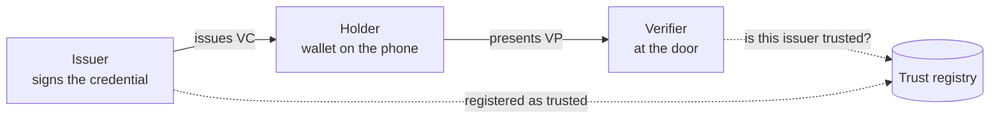
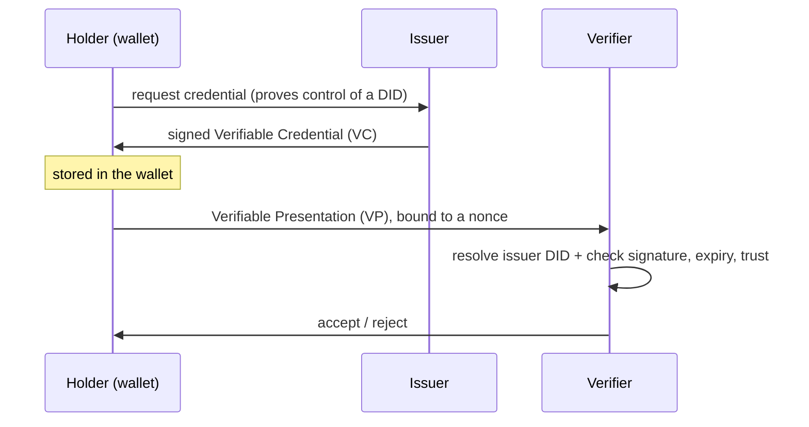
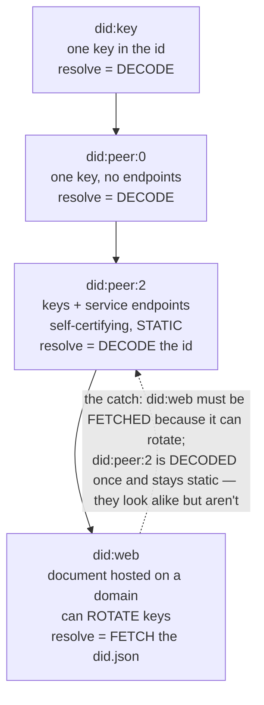

# DESIGN — `credentials` (Cedar practice blueprint)

> **Status: DESIGN ONLY — not a runnable practice yet.** This folder deliberately contains no
> `practice.json`, `src/`, or `_solutions/`, so the harness will not list or run it. This file is
> the blueprint a follow-up build session consumes to produce the runnable, graded, proof-recorded
> kata per [`generator/CONTRACT.md`](../../generator/CONTRACT.md) and
> [`context/cedar/generation-spec.md`](../../context/cedar/generation-spec.md). Draft `practice.json`
> and `_solutions/` plans are embedded below.

## Overview
- **id:** `credentials` · **title:** "Credentials — verifiable-credential issuance & presentation"
- **Context:** `cedar@1.0.0` · **difficulty:** `XL`
- **Domain:** decentralized identity — a startup issues, holds, and verifies **Verifiable
  Credentials (VCs)**.
- **Stack (multi-package, both graded):**
  - `backend/` — **Rust** issuer + verifier service (signs VCs, verifies presentations, resolves
    issuer DIDs).
  - `app/` — **Flutter/Dart** holder **wallet** (requests a VC, stores it, builds a presentation).
  - `reference/` — **read-only external truth**: the current DID-method spec, the S3/CloudFront-
    hosted issuer `did.json` documents, and the sibling **trust-registry** service contract.
- **Trains:** the full Alder core set **plus** Cedar's *establish-cross-boundary-context* and
  *reconcile-docs*. Failure modes: FM-01, FM-02, FM-03, FM-04, FM-05, FM-06, FM-07, FM-08, FM-13,
  **FM-15**, **FM-16** (+ FM-14 on the review phase).
- **The Cedar thesis in one line:** the exercise is *complex in the fog, small in the fix* — the
  multi-repo/hosted-infra setup and two layers of drifting docs make the bug hard to *understand*;
  the correct change itself is a handful of lines.

## Intended repository layout
```
credentials/
  backend/            # Rust: src/ (issuer, verifier, did resolver, status, store) + tests
  app/                # Flutter: lib/ (wallet, presentation builder) + test/ + integration_test/
  reference/          # READ-ONLY: did-web-method.md, infra/hosted-dids/*.json, trust-registry.md
  _solutions/         # hidden answer key (see plan below)
  TICKET.md  FEATURE-REQUEST.md  README.md  practice.json  grade.sh
```

---

## Domain primer (to be lifted into `README.md` → Background)

A niche domain, so the learner-facing README **opens with this** — plain language + diagrams that
teach the domain **without pointing at the bug** (scaffolding, not a hint).

**The three roles.** An **issuer** signs a claim about you. You, the **holder**, keep it in a
wallet. A **verifier** checks it when you present it. A **trust registry** lets a verifier decide
whether an issuer is one it trusts.



**What a VC is, and its lifecycle.** A **Verifiable Credential** is a signed set of claims (e.g.
"member in good standing, expires 2027-01"). The holder presents it as a **Verifiable Presentation
(VP)** — the VC wrapped and signed by the holder, bound to a one-time **nonce** so it can't be
replayed.



**DID methods — the crux of this kata.** A **DID** ("decentralized identifier") names a subject;
**resolving** it means fetching the **DID Document** (its public keys + service endpoints). Methods
differ in *how* you resolve — and that difference is the whole exercise:

- **`did:key`** — one public key packed into the identifier itself. Resolve = **decode the string**.
  Simplest; no service endpoints, no key rotation.
- **`did:peer:0`** — a single inception key, self-contained; still no endpoints. Resolve = **decode
  the string**. (did:key's peer cousin.)
- **`did:peer:2`** — multiple keys **and service endpoints** encoded into the identifier → a *full*
  DID Document. Resolve = **decode the string**. Crucially, it is **self-certifying and static**:
  everything you need is *in the id*, so a document you built once stays valid.
- **`did:web`** — the DID Document is **hosted on a web domain**
  (`did:web:issuer.example` → `https://issuer.example/.well-known/did.json`). Resolve = **HTTP GET
  that document**. It supports **key rotation and endpoints**, but it is **not** self-certifying:
  the truth is whatever the domain serves *now*, and resolution **crosses a network/infra boundary**.



---

## The repo's true history (the setup for every trap)
The service grew the way AI-assisted repos really do — simplest-first, migrated *mostly*, not
everywhere:
1. **Started on `did:key`** (one key, dead simple).
2. **Moved to `did:peer:2`** when issuers needed service endpoints and multiple keys.
3. **Migrated to `did:web`** (current, authoritative) so issuers could **rotate keys** without
   re-issuing every credential.

The current system is **did:web**. But the migration left two kinds of rot behind.

## Primary bug — context rot buried in code (FM-15 + FM-01/02, cause across the boundary FM-16)
**The abandoned assumption:** *"a DID Document is static and self-certifying — capture it once and
reuse it."* That was **true** in the did:key/peer:2 era. It is **silently false** for did:web,
which can rotate.

**Where it hides:** a long-untouched issuer-DID resolution path (used on the verification side)
still honors that assumption — for a `did:web` issuer it reuses the **document snapshot captured at
onboarding** instead of **fetching the current `did.json`**. No README or comment mentions this; it
just reads like ordinary resolver code. It survives because the **large green suite** uses issuer
fixtures that **never rotated**, so snapshot == current and everything passes.

**How it fails (the edge case did:web exists for):** an issuer that **rotated its signing key**
after onboarding. Credentials signed with the new key fail verification, because the stale path
checks them against the **old snapshot**. The current key lives only in the **hosted `did.json`**
in `reference/` — the local repo never has it.

**Why pure prompting won't find it:** nothing in the repo points at rotation, did:web, or a
snapshot; the docs actively mislead (below); the suite is green. The learner must **reproduce**
under a rotated issuer and **read `reference/`** to discover the system is did:web and that
resolution must be a live fetch.

**Ambient axis (Cedar's extended FM-02): the issuer's hosted-document state**, which the local repo
never parameterized. Graded worst-case across ≥3 issuers: (a) never rotated, (b) rotated signing
key, (c) rotated + changed service endpoint.

**TICKET.md symptom (no file/line):** *"Members from issuers we onboarded a while ago verify fine,
but a batch we re-approved last month gets rejected at the door — same app, same steps."*

## FM-13 plateau (mandatory autopilot trap — verified to bite)
- **Symptom-patch** (fix at the call site — e.g. special-case the failing credential in the VP
  handler): leaves the **root-tested** grader red (the grader calls the resolver/verify path
  directly).
- **The "obvious" autopilot fix**: re-pin / refresh **the one failing issuer's** snapshot, or
  hard-code its new key from the ticket. Passes that issuer and the whole visible suite — then
  **plateaus**: the next rotated issuer (or the same issuer's next rotation) fails again.
- **Only convergence:** implement **real did:web resolution** — fetch the current `did.json` per the
  `reference/` method spec — so *any* rotation resolves correctly. (Caching/TTL is a named aside,
  **not** built — restraint / altitude-match.) This is the per-instant/DST analogue of the seed kata.

## FM-16 cross-boundary trap — the truth lives only in `reference/`
`reference/` holds what the single repo cannot see:
- `reference/did-web-method.md` — the method spec: did:web resolves by **HTTPS GET** of the hosted
  document; documents **rotate**; verify against the **current** verification method.
- `reference/infra/hosted-dids/*.json` — the **S3/CloudFront-hosted `did.json`** for each issuer,
  including the **rotated** keys the local snapshot doesn't have.
- `reference/trust-registry.md` — the sibling service's contract: which issuer DIDs are trusted, and
  that trust is keyed on the **DID**, checked live.

A single-repo autopilot "reads the code," sees a resolver that already returns rich documents, and
assumes it's correct — **locally green, globally wrong**. The escape is the **research pass**: read
`reference/`, write **`research-notes.md`** ("we're on did:web; resolution is a live fetch; docs
rotate; the snapshot is stale"), *then* delegate. The grader embeds **conformance vectors derived
from the hosted documents**, so a fix that never read `reference/` fails them.

## FM-15 doc-drift traps — maximum misdirection (see `_solutions/doc-drift-ledger.md`)
- **Headline:** `backend/README.md` still says *"we identify issuers with `did:key`"* — **two
  migrations stale**. A naive prompter chases did:key and never reaches did:web.
- A `backend/src/…` comment references *"peer DIDs"* (the peer:2 era) near the stale resolver.
- `app/README.md` describes credentials as **JWT-VC** while the backend emits **JSON-LD VCs**.
- A field-name drift: docs say `expirationDate`; code uses `expires_at`.
- A README line claims *"credentials are single-use"* that the code does **not** enforce (this
  becomes the feature's held-back requirement).
- The ledger names, for each, the **authoritative source** (current `backend/` code + `reference/`)
  and states plainly: *README says did:key, the code mostly does did:web, and one stale path assumes
  static/self-certifying documents.*

## Underspecified feature (phase 3 — FM-03 / read-before-delegate)
**FEATURE-REQUEST.md (2–3 sentences):** *"Let a member share their membership as a presentation the
door scanner can check. Add `WalletService.createPresentation(...)` in the app."* ⚠️ hint: *read how
the verifier checks a presentation before you build the holder side.*

The naive impl leaks everything or breaks holder-binding. **Held-back questions (`_solutions/feature-qa.md`, 6–8):**
1. Which claims are disclosed — all of them, or a selected subset (selective disclosure)?
2. Is the VP **signed by the holder's** key (holder binding), not just wrapping the issuer's VC?
3. Is it **bound to the verifier's nonce + domain** (anti-replay)?
4. What happens if the credential is **expired** at presentation time?
5. Must the holder **check revocation/status** before presenting, or is that the verifier's job?
6. **Single-use?** (The README claims it; the code doesn't. Resolve out loud — v1 answer: no
   enforced single-use; the nonce prevents replay of the *same* VP.)
7. Online or offline verification (does presenting require a network call)?
8. What is the minimal correct surface — and what is explicitly deferred?

**Minimal correct behaviour:** build a VP that discloses the requested subset, signed by the holder
key, bound to the verifier nonce+domain, refusing to present an expired VC; everything else deferred
out loud.

## Ranked latent defects (findable, mapped to FMs — for `_solutions/trap-manifest.md`)
1. **FM-06** — VP replay: verifier dedupes on a transport `requestId`, not the presentation
   `nonce`/`jti`; a replay with a fresh requestId is accepted.
2. **FM-05** — the wallet store returns the stored credential (and key handle) **by reference**,
   letting a caller mutate held state.
3. **FM-07** — the verifier's `seen_nonces` (or status cache) grows **unbounded**.
4. **FM-04** — `exp`/`nbf` compared with strict `<`/`>` at the exact instant; the boundary is
   unspecified and untested.
5. **FM-03** — revocation status-list **bit index off-by-one** (or a "fresh = within 30 days"
   approximation).
6. **FM-08** — an issuer DID is trusted **without checking the trust registry** in `reference/`, so
   a spoofed issuer is accepted.
7. **FM-03** — an unknown proof-type / unknown DID method **falls through to "valid."**
8. *(optional 8th, keeps VC realism)* **FM-03/encoding** — JSON canonicalization keyed on `HashMap`
   iteration order, so signatures verify in-process but not cross-stack.

## Dual grade design (both stacks; combined worst-case)
`commands.grade` = **`bash grade.sh`**, which runs and ANDs:
- **(a) `cargo run --bin grade`** (in `backend/`) — the hidden acceptance suite calling the
  resolver/verify **root** directly, across ≥3 issuer states (never-rotated / rotated-key /
  rotated-endpoint) **plus** the `reference/`-derived conformance vectors. Reports worst-case.
- **(b) `flutter test integration_test/`** (in `app/`) — the wallet builds a VP the Rust verifier
  **accepts**, and correctly **rejects** a tampered / expired / replayed one.

Exit 0 only if **both** pass at worst-case. **Hermetic:** pinned Rust + Flutter toolchains, **no
network** (the "hosted" did.json documents are served from vendored `reference/infra/` fixtures via
a local file/loopback resolver), conformance vectors vendored. **Fallback recorded in notes:** if
the Flutter gate is too heavy for CI, grade `backend/` only at `grade` level and demote the
cross-stack check to `test` level.

## The five-phase flow (research pass lives inside *understand*)
1. **understand** — map both packages *and* **do the research pass**: read `reference/`, write
   `research-notes.md` (the FM-16 escape). Establish: current method = did:web; resolution = live
   fetch; docs rotate; README is stale.
2. **fix** — reproduce with a rotated-issuer failing test (FM-01/02), then implement real did:web
   resolution at the root (escape the FM-13 plateau).
3. **feature** — elicit the held-back requirements, build the minimal correct VP.
4. **improve** — find the ranked latent defects; fix the ones in scope, surface the rest (restraint).
5. **review** — triage + intent (FM-14): a human owns the merge; the diff stays small.

---

## Draft `practice.json` (the build session finalizes this)
```json
{
  "id": "credentials",
  "title": "Credentials — verifiable-credential issuance & presentation",
  "contextVersion": "cedar@1.0.0",
  "domain": "decentralized identity / verifiable credentials",
  "stack": {
    "packages": [
      { "path": "backend", "language": "rust", "runtime": "rust>=1.79", "dependencies": 0 },
      { "path": "app", "language": "dart", "runtime": "flutter>=3.24", "dependencies": 0 }
    ]
  },
  "difficulty": "XL",
  "estimate": { "minutes": 135, "tokens": 60000 },
  "phases": ["understand", "fix", "feature", "improve", "review"],
  "reference": "reference/",
  "researchArtifact": "research-notes.md",
  "commands": {
    "install": "cd backend && cargo fetch; cd ../app && flutter pub get",
    "test": "cd backend && cargo test; cd ../app && flutter test",
    "grade": "bash grade.sh"
  },
  "grader": { "kind": "hidden-acceptance", "max": 12 },
  "trainingPoints": {
    "disciplines": ["reproduce-before-fix", "requirements-elicitation", "read-before-delegate", "model-before-delegation", "comprehension-as-ownership", "verify-output", "restraint-altitude-match", "reject-on-camera", "establish-cross-boundary-context", "reconcile-docs"],
    "failureModes": ["FM-01", "FM-02", "FM-03", "FM-04", "FM-05", "FM-06", "FM-07", "FM-08", "FM-13", "FM-14", "FM-15", "FM-16"]
  },
  "primaryBug": "a stale resolver reuses an onboarding-time DID Document snapshot for did:web issuers instead of fetching the current did.json, so credentials from rotated issuers fail verification (the abandoned did:peer:2 'documents are static/self-certifying' assumption, no doc trace)",
  "featureTrap": "createPresentation must bind to holder key + verifier nonce/domain and disclose a subset; the naive VP leaks all claims and is replayable",
  "assistantTrap": "autopilot loops: symptom-patching the VP handler leaves the root-tested grader red; re-pinning the one failing issuer's snapshot passes the suite but plateaus on the next rotation; only real did:web fetch converges",
  "docDriftTrap": "backend README still says did:key (two migrations stale) and a comment references peer DIDs; the current system is did:web and one path still assumes static documents",
  "crossBoundaryTrap": "the current (rotated) issuer keys live only in reference/infra/hosted-dids/*.json and the did:web method spec; a single-repo run assumes the local snapshot is authoritative and fails the reference-derived conformance vectors",
  "latentDefects": 8,
  "answerKey": "_solutions/",
  "notes": "XL tier; provisional estimate. Dual grade gate (Rust + Flutter) is hermetic via vendored reference/infra fixtures and a loopback resolver; Rust-only is the documented fallback if the Flutter gate is too heavy for CI."
}
```

## `_solutions/` plan (build session produces these)
- `backend/…/acceptance.rs` + `app/integration_test/…` — hidden graders; start failing.
- `grade.sh` — the wrapper; ≥3 issuer states + conformance vectors; combined worst-case.
- `FIX.md` — real did:web fetch at the resolver root; why the re-pin fix plateaus; the caching aside.
- `feature-qa.md` — the 6–8 held-back questions above, with answers + minimal correct behaviour.
- `trap-manifest.md` — every planted item → FM id + location; **verified-to-bite** notes for the
  FM-13 plateau, the FM-15 stale path + stale README, and the FM-16 no-research run.
- `rubric.md` — objective gate (both stacks, worst-case) + driving axis, adding items for the
  research pass (FM-16) and doc reconciliation (FM-15).
- `context-map.md` — the golden cross-boundary contract (current method, hosted-doc truth, the one
  load-bearing fact).
- `doc-drift-ledger.md` — every contradiction + its authoritative source.
- `proof-<mode>-<YYYY-MM-DD>.html` — recorded end-to-end run (generator CONTRACT step 10).

## Build TODO (out of scope now; the follow-up session)
1. Write `backend/` (issuer, verifier, did resolver with the stale did:web branch, status, store),
   `app/` (wallet + presentation stub), and `reference/` fixtures + the loopback resolver.
2. Write the GREEN unit suites (bug invisible: fixtures never rotate).
3. Wire the hidden graders + `grade.sh`; **verify the traps bite** (symptom-patch red; re-pin
   plateaus; no-research run fails the conformance vectors).
4. Fill the real `practice.json` (drop `status`), lift the primer into `README.md`, write
   `TICKET.md` / `FEATURE-REQUEST.md`.
5. Drive it once end-to-end (a `train` run) and record `_solutions/proof-train-<date>.html`.
6. Fresh-context reviewer confirms it's solvable at XL altitude — not over-scoped.
