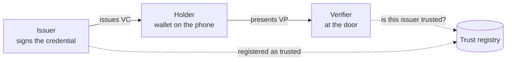
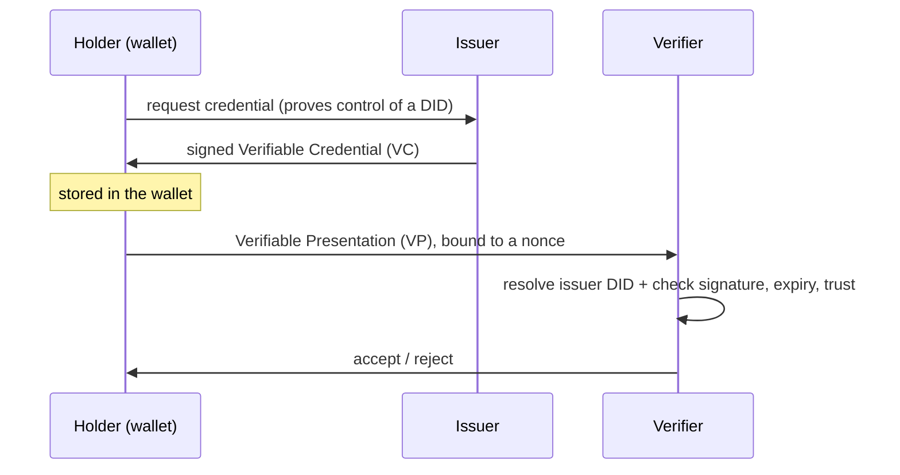
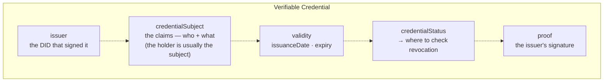
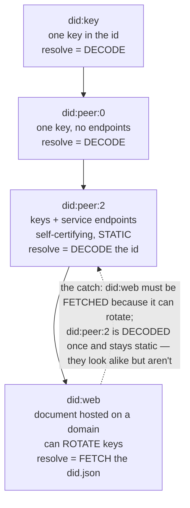
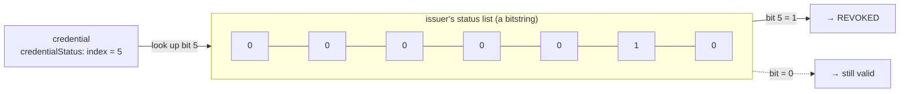
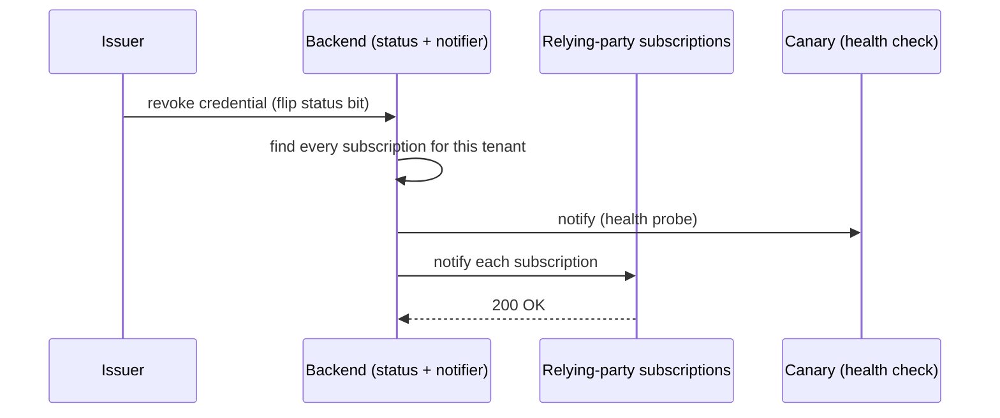
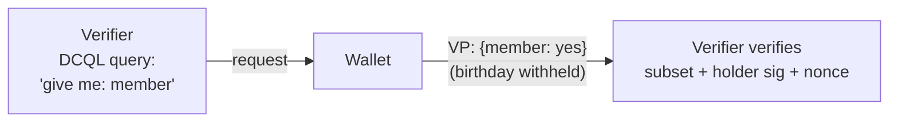

# DESIGN — `credentials` (Cedar practice blueprint)

> **Status: DESIGN ONLY — not a runnable practice yet.** This folder deliberately contains no
> `practice.json`, `src/`, or `_solutions/`, so the harness will not list or run it. This file is
> the blueprint a follow-up build session consumes to produce the runnable, graded, proof-recorded
> kata per [`generator/CONTRACT.md`](../../generator/CONTRACT.md) and
> [`context/cedar/generation-spec.md`](../../context/cedar/generation-spec.md). Draft `practice.json`
> and `_solutions/` plans are embedded below.

## Overview
- **id:** `credentials` · **title:** "Credentials — verifiable-credential issuance & presentation"
- **Context:** `cedar@1.1.0` · **difficulty:** `XL`
- **Domain:** decentralized identity — a startup issues, holds, verifies, and **revokes**
  **Verifiable Credentials (VCs)**. The stack is grounded in a real SSI toolkit
  ([Affinidi](https://github.com/affinidi)) — see *Affinidi OSS — real deps in safe roles* below.
- **Stack (multi-package, both graded):**
  - `backend/` — **Rust** issuer + verifier service (signs VCs, verifies presentations, resolves
    issuer DIDs, tracks credential **status/revocation**, and **notifies relying parties by webhook**
    when a status changes).
  - `app/` — **Flutter/Dart** holder **wallet** (requests a VC, stores it, builds a presentation).
  - `reference/` — **read-only external truth**: the current DID-method spec, the S3/CloudFront-
    hosted issuer `did.json` documents, the sibling **trust-registry** service contract, and the
    **infra config** for the webhook notifier (its dispatch budget, its alarm policy).
- **Two staged bug tickets, delivered easy → hard** (staging is part of the exercise; see §The
  five-phase flow):
  - **Ticket 1 (warm-up):** the did:web **stale-snapshot rotation** bug — the *complex-in-the-fog*
    centrepiece, defeated by the cross-boundary research pass.
  - **Ticket 2 (finale):** the AI-generated **webhook fan-out incident** — a *four-axis* operational
    defect where fixing any single axis does **not** resolve the incident, and a green canary hides a
    red customer.
- **Trains:** the full Alder core set **plus** Cedar's *establish-cross-boundary-context* and
  *reconcile-docs*. Failure modes: FM-01, FM-02, FM-03, FM-04, FM-05, FM-06, FM-07, FM-08, FM-13,
  **FM-15**, **FM-16** (+ FM-14 on the review phase). Ticket 2 needs no new FM id — it is a second,
  *operational* instantiation of FM-01/02/03/05/08 (+ FM-16 for the infra truth).
- **The Cedar thesis in one line:** the exercise is *complex in the fog, small in the fix* — the
  multi-repo/hosted-infra setup and two layers of drifting docs make each bug hard to *understand*;
  the correct change itself is a handful of lines (per axis, even for the four-axis finale).

## Intended repository layout
```
credentials/
  backend/            # Rust: src/ (issuer, verifier, did resolver, status/revocation, store,
                      #   webhook notifier + canary) + tests
  app/                # Flutter: lib/ (wallet, presentation builder) + test/ + integration_test/
  reference/          # READ-ONLY: did-web-method.md, infra/hosted-dids/*.json, trust-registry.md,
                      #   infra/webhook-config.* (dispatch budget + alarm policy), reserved-domain note
  _solutions/         # hidden answer key (see plan below)
  TICKET-1.md         # cloned at start (did:web bug)
  TICKET-2.md         # STAGED IN after Ticket 1 lands (webhook incident)
  FEATURE-REQUEST.md  # STAGED IN at phase 3 (feature)
  README.md  practice.json                # exercise material — NOT cloned
```
The hermetic gate replaces the `example.com` canary target with a **vendored loopback stub** fixture;
nothing in the clone hints that the canary's real target is wrong.

---

## Domain primer (to be lifted into `README.md` → Background)

A niche domain, so the learner-facing README **opens with this** — plain language + diagrams that
teach the domain **without pointing at the bug** (scaffolding, not a hint).

**The three roles.** An **issuer** signs a claim about you. You, the **holder**, keep it in a
wallet. A **verifier** checks it when you present it. A **trust registry** lets a verifier decide
whether an issuer is one it trusts.



**What a VC is, and its lifecycle.** A **Verifiable Credential** is a signed set of claims (e.g.
"member in good standing, expires 2027-01"). The holder presents it as a **Verifiable Presentation
(VP)** — the VC wrapped and signed by the holder, bound to a one-time **nonce** so it can't be
replayed.



**Anatomy of a VC.** A credential is not free-text — it is a structured object with named parts. The
one part newcomers miss is the **status reference**: a pointer that says *where to check, later,
whether this credential is still valid* — because a credential can be **revoked after it was issued**
(see below). Reading a VC means knowing which part carries what:



**DID methods — the crux of this kata.** A **DID** ("decentralized identifier") names a subject;
**resolving** it means fetching the **DID Document** (its public keys + service endpoints). Methods
differ in *how* you resolve — and that difference is the whole exercise:

- **`did:key`** — one public key packed into the identifier itself. Resolve = **decode the string**.
  Simplest; no service endpoints, no key rotation.
- **`did:peer:0`** — a single inception key, self-contained; still no endpoints. Resolve = **decode
  the string**. (did:key's peer cousin.)
- **`did:peer:2`** — multiple keys **and service endpoints** encoded into the identifier → a *full*
  DID Document. Resolve = **decode the string**. Crucially, it is **self-certifying and static**:
  everything you need is *in the id*, so a document you built once stays valid.
- **`did:web`** — the DID Document is **hosted on a web domain**
  (`did:web:issuer.example` → `https://issuer.example/.well-known/did.json`). Resolve = **HTTP GET
  that document**. It supports **key rotation and endpoints**, but it is **not** self-certifying:
  the truth is whatever the domain serves *now*, and resolution **crosses a network/infra boundary**.



**Revocation & status lists.** Signing a credential is not the end of its life. Membership lapses,
a badge is withdrawn — so an issuer needs a way to say *"this one is no longer valid"* **without
re-issuing anything**. The standard shape is a **status list**: the issuer publishes one long
**bitstring**, every credential it issues carries an **index** into that list (the `credentialStatus`
part above), and to revoke credential *N* the issuer flips **bit *N*** from 0 to 1. A verifier checks
validity by reading the bit at that index.



**Status changes are pushed to relying parties by webhook.** A verifier could re-read the whole
status list on every check, but relying parties usually want to *hear about* a change as it happens.
So when a status flips, the backend **fans out a webhook** to every relying-party subscription, and a
built-in **canary** subscription lets the team confirm the notifier is alive. This is the
architecture Ticket 2 lives in — drawn here as ordinary plumbing, because that is how it reads in the
repo:



**Presentation & selective disclosure (DCQL).** When a holder presents a credential, the verifier
doesn't always need *every* claim — a door scanner may need only "member: yes", not your birthday.
The verifier expresses *what it wants* as a **DCQL** query (Digital Credentials Query Language); the
wallet answers with a VP that discloses **only that subset**, still signed by the holder and bound to
the verifier's nonce + domain. This is the mechanism the phase-3 feature builds on.



---

## The repo's true history (the setup for every trap)
The service grew the way AI-assisted repos really do — simplest-first, migrated *mostly*, not
everywhere:
1. **Started on `did:key`** (one key, dead simple).
2. **Moved to `did:peer:2`** when issuers needed service endpoints and multiple keys.
3. **Migrated to `did:web`** (current, authoritative) so issuers could **rotate keys** without
   re-issuing every credential.
4. **Added a status-change webhook notifier** — generated in a single AI-assisted pass and shipped
   through a review that skimmed it — so relying parties could be told when a credential is revoked.

The current system is **did:web**. The migration left two kinds of rot behind (Ticket 1); the
generated-in-one-pass notifier shipped with four latent flaws nobody caught (Ticket 2).

## Ticket 1 — did:web stale snapshot (warm-up, delivered first) · context rot buried in code (FM-15 + FM-01/02, cause across the boundary FM-16)
**This is the first staged ticket** — the clone starts with `TICKET-1.md` and nothing else. It is
the *complex-in-the-fog* bug: hard to understand, small to fix once understood.

**The abandoned assumption:** *"a DID Document is static and self-certifying — capture it once and
reuse it."* That was **true** in the did:key/peer:2 era. It is **silently false** for did:web,
which can rotate.

**Where it hides:** a long-untouched issuer-DID resolution path (used on the verification side)
still honors that assumption — for a `did:web` issuer it reuses the **document snapshot captured at
onboarding** instead of **fetching the current `did.json`**. No README or comment mentions this; it
just reads like ordinary resolver code. It survives because the **large green suite** uses issuer
fixtures that **never rotated**, so snapshot == current and everything passes.

**How it fails (the edge case did:web exists for):** an issuer that **rotated its signing key**
after onboarding. Credentials signed with the new key fail verification, because the stale path
checks them against the **old snapshot**. The current key lives only in the **hosted `did.json`**
in `reference/` — the local repo never has it.

**Why pure prompting won't find it:** nothing in the repo points at rotation, did:web, or a
snapshot; the docs actively mislead (below); the suite is green. The learner must **reproduce**
under a rotated issuer and **read `reference/`** to discover the system is did:web and that
resolution must be a live fetch.

**Ambient axis (Cedar's extended FM-02): the issuer's hosted-document state**, which the local repo
never parameterized. Graded worst-case across ≥3 issuers: (a) never rotated, (b) rotated signing
key, (c) rotated + changed service endpoint.

**TICKET.md symptom (no file/line):** *"Members from issuers we onboarded a while ago verify fine,
but a batch we re-approved last month gets rejected at the door — same app, same steps."*

## FM-13 plateau — Ticket 1 (mandatory autopilot trap — verified to bite)
*The practice carries **two** plateaus of the same shape: this did:web re-pin plateau (Ticket 1),
and the **miss-one-of-four** operational plateau in Ticket 2 above. Either alone satisfies invariant
9; together they train the pattern on both a comprehension axis and an operational axis.*
- **Symptom-patch** (fix at the call site — e.g. special-case the failing credential in the VP
  handler): leaves the **root-tested** grader red (the grader calls the resolver/verify path
  directly).
- **The "obvious" autopilot fix**: re-pin / refresh **the one failing issuer's** snapshot, or
  hard-code its new key from the ticket. Passes that issuer and the whole visible suite — then
  **plateaus**: the next rotated issuer (or the same issuer's next rotation) fails again.
- **Only convergence:** implement **real did:web resolution** — fetch the current `did.json` per the
  `reference/` method spec — so *any* rotation resolves correctly. (Caching/TTL is a named aside,
  **not** built — restraint / altitude-match.) This is the per-instant/DST analogue of the seed kata.

## FM-16 cross-boundary trap — the truth lives only in `reference/`
`reference/` holds what the single repo cannot see:
- `reference/did-web-method.md` — the method spec: did:web resolves by **HTTPS GET** of the hosted
  document; documents **rotate**; verify against the **current** verification method.
- `reference/infra/hosted-dids/*.json` — the **S3/CloudFront-hosted `did.json`** for each issuer,
  including the **rotated** keys the local snapshot doesn't have.
- `reference/trust-registry.md` — the sibling service's contract: which issuer DIDs are trusted, and
  that trust is keyed on the **DID**, checked live.
- **(Ticket 2)** `reference/infra/webhook-config.*` — the notifier's real **dispatch budget** and the
  fact that **no timeout alarm is configured** (A1); and the **reserved-domain rule** that
  `example.com` must never be a live endpoint (A4). Neither is visible from the backend code alone —
  a single-scope run can't see the budget it's blowing or that its canary target is reserved.

A single-repo autopilot "reads the code," sees a resolver that already returns rich documents, and
assumes it's correct — **locally green, globally wrong**. The escape is the **research pass**: read
`reference/`, write **`research-notes.md`** ("we're on did:web; resolution is a live fetch; docs
rotate; the snapshot is stale"), *then* delegate. The grader embeds **conformance vectors derived
from the hosted documents**, so a fix that never read `reference/` fails them.

## FM-15 doc-drift traps — maximum misdirection (see `_solutions/doc-drift-ledger.md`)
- **Headline:** `backend/README.md` still says *"we identify issuers with `did:key`"* — **two
  migrations stale**. A naive prompter chases did:key and never reaches did:web.
- A `backend/src/…` comment references *"peer DIDs"* (the peer:2 era) near the stale resolver.
- `app/README.md` describes credentials as **JWT-VC** while the backend emits **JSON-LD VCs**.
- A field-name drift: docs say `expirationDate`; code uses `expires_at`.
- A README line claims *"credentials are single-use"* that the code does **not** enforce (this
  becomes the feature's held-back requirement).
- **(Ticket 2)** `backend/README.md` (or a notifier comment) claims *"status notifications are
  delivered concurrently to every subscriber, with failed deliveries retried"* — the code delivers
  **sequentially** and does **not** retry. Written by someone who believed it; it misleads a reader
  into thinking the fan-out is already fault-isolated.
- The ledger names, for each, the **authoritative source** (current `backend/` code + `reference/`)
  and states plainly: *README says did:key, the code mostly does did:web, and one stale path assumes
  static/self-certifying documents.*

## Ticket 2 — the webhook fan-out incident (the finale) · FM-13 plateau on the operational axis
**Staged in only after Ticket 1's fix lands** (`TICKET-2.md`). This is the four-axis defect the user
drew from a real incident: an AI-generated status-notification webhook where **four independent things
are wrong at once**, none caught in review, and **fixing any single axis does not resolve the
incident**. It reprises the Cedar thesis on the *operational/reliability* axis — a **green canary
hides a red customer** (FM-01/FM-02), and the load-bearing truth lives in `reference/` (FM-16).

Domain home: the **status-change webhook notifier**. When a credential is revoked (a status-list bit
flips), the backend finds every relying-party subscription for the tenant and fans out a webhook. No
real AWS/DynamoDB — the "infra" facts live in `reference/infra/`, the store is an in-repo Rust
analogue.

| Axis | FM | How it hides / how it's planted | The convergent fix |
|---|---|---|---|
| **A1 — silent timeout, no alert** | FM-01 + observability gap | A hardcoded dispatch budget (the AWS-Lambda-default 10s analogue); the timeout path is **log-only**, emits no metric/event. The real budget + the *absent* alarm policy live only in `reference/infra/webhook-config.*`. | Emit an **observable signal** on timeout (a counter/event the grader can assert). |
| **A2 — synchronous head-of-line** | FM-05 (local optimize, global fail) + FM-02 (subset: everything after the slow one) | `for sub in subs { dispatch(sub).await }` — sequential, sharing one budget; one slow/hanging endpoint starves the rest. | **Concurrent** dispatch with **per-call** timeout isolation. |
| **A3 — unindexed scan** | FM-02 (subset: large tenants) + FM-03 (idiomatic-looking scan) | The "find subscriptions for this tenant" lookup **iterates all settings** instead of using a keyed index; slow for a tenant with many settings, which drives the batch over budget. | A **keyed lookup / proper index**. |
| **A4 — the canary lies** | FM-01 (green ≠ correct) + FM-08 (misused reserved external resource) | The built-in canary targets **`example.com`** (reserved by RFC 2606 — *"do not use in production"*) **and is registered at index 0**, so it always fires before starvation/budget exhaustion. Health stays green while real subscriptions get nothing. | Internal **loopback stub**; the canary exercises the **real path** (no privileged position), so a passing canary *implies* real delivery. |

**The compound / plateau property (the whole point).** The Ticket-2 grader scores **worst-case across
`{small tenant, large tenant} × {all-healthy, one-slow-endpoint}`** and asserts: every *real*
subscription is delivered within budget, a timeout is **observable**, and **a passing canary implies
real delivery**. So a single-axis fix stays **red** — async-only still times out on a large tenant
(A3); index-only still starves on a hanging endpoint (A2); delivery-fixed-but-canary-left still passes
the canary while a graded real delivery fails (A4); no-signal-on-timeout leaves the observability
assert red (A1). **Only catching all four converges** — the FM-13 plateau, operational edition.

**The canary-at-index-0 tell** is the engineer-mindset detail from the real incident (*"I put my own
webhook first to prove the loop is even reached"*): a careful reader notices the canary's privileged
position and realizes the health check never exercises what customers hit. That noticing is the
review-phase (FM-14) evidence for A4.

**TICKET-2.md symptom (invariant-12 clean — symptom + promise only, no axis, no method, no grader):**
*"Our webhook health check is green, but a customer we onboarded — one with a lot of settings — says
their revocation callbacks never arrive. Other customers are fine. Same code, same steps."*

## Underspecified feature (phase 3 — FM-03 / read-before-delegate)
**FEATURE-REQUEST.md (2–3 sentences):** *"Let a member share their membership as a presentation the
door scanner can check. Add `WalletService.createPresentation(...)` in the app."* ⚠️ hint: *read how
the verifier checks a presentation before you build the holder side.*

The naive impl leaks everything or breaks holder-binding. **Held-back questions (`_solutions/feature-qa.md`, 6–8):**
1. Which claims are disclosed — all of them, or a selected subset (selective disclosure)?
2. Is the VP **signed by the holder's** key (holder binding), not just wrapping the issuer's VC?
3. Is it **bound to the verifier's nonce + domain** (anti-replay)?
4. What happens if the credential is **expired** at presentation time?
5. Must the holder **check revocation/status** before presenting, or is that the verifier's job?
6. **Single-use?** (The README claims it; the code doesn't. Resolve out loud — v1 answer: no
   enforced single-use; the nonce prevents replay of the *same* VP.)
7. Online or offline verification (does presenting require a network call)?
8. What is the minimal correct surface — and what is explicitly deferred?

**Minimal correct behaviour:** build a VP that discloses the requested subset, signed by the holder
key, bound to the verifier nonce+domain, refusing to present an expired VC; everything else deferred
out loud. The requested subset is expressed as a **DCQL** query and satisfied with
**`affinidi-dcql-dart`** (a real, standards-based mechanism, not a forced dependency) — see *Affinidi
OSS* below.

## Ranked latent defects (findable, mapped to FMs — for `_solutions/trap-manifest.md`)
*Deconflicted with Ticket 2: the notifier's four axes (FM-05 sync loop / FM-02 subset / FM-03 scan /
FM-01 canary) are a **graded cluster** owned by Ticket 2, not loose latents, and are **not** re-counted
here. The FM-05 and FM-03 items below are **distinct instances** in different modules (the wallet store;
the status-list bit index) — a careful reader finds them independently.*
1. **FM-06** — VP replay: verifier dedupes on a transport `requestId`, not the presentation
   `nonce`/`jti`; a replay with a fresh requestId is accepted.
2. **FM-05** — the wallet store returns the stored credential (and key handle) **by reference**,
   letting a caller mutate held state.
3. **FM-07** — the verifier's `seen_nonces` (or status cache) grows **unbounded**.
4. **FM-04** — `exp`/`nbf` compared with strict `<`/`>` at the exact instant; the boundary is
   unspecified and untested.
5. **FM-03** — revocation status-list **bit index off-by-one** (or a "fresh = within 30 days"
   approximation).
6. **FM-08** — an issuer DID is trusted **without checking the trust registry** in `reference/`, so
   a spoofed issuer is accepted.
7. **FM-03** — an unknown proof-type / unknown DID method **falls through to "valid."**
8. *(optional 8th, keeps VC realism)* **FM-03/encoding** — JSON canonicalization keyed on `HashMap`
   iteration order, so signatures verify in-process but not cross-stack.

## Dual grade design (both stacks; combined worst-case)
`commands.grade` = **`bash _solutions/grade.sh`**, which runs and ANDs:
- **(a) `cargo run --bin grade`** (in `backend/`, Ticket 1) — the hidden acceptance suite calling the
  resolver/verify **root** directly, across ≥3 issuer states (never-rotated / rotated-key /
  rotated-endpoint) **plus** the `reference/`-derived conformance vectors. Reports worst-case.
- **(a2) the webhook acceptance suite** (in `backend/`, Ticket 2) — drives the notifier **root**
  across `{small tenant, large tenant} × {all-healthy, one-slow-endpoint}` and asserts: every real
  subscription delivered within budget, a timeout is **observable**, and **canary-pass ⇒ real
  delivery**. **Any single-axis fix stays red** (the four-axis plateau). Reports worst-case.
- **(b) `flutter test integration_test/`** (in `app/`) — the wallet builds a VP the Rust verifier
  **accepts** (subset via **DCQL**), and correctly **rejects** a tampered / expired / replayed one.

Exit 0 only if **all three** pass at worst-case. **Hermetic:** pinned Rust + Flutter toolchains,
**vendored Affinidi deps**, **no network** (the "hosted" did.json documents *and* the canary target
are served from vendored `reference/infra/` fixtures via a local file/loopback resolver — the
`example.com` canary resolves to the **loopback stub**), conformance vectors vendored. **Fallback
recorded in notes:** if the Flutter gate is too heavy for CI, grade `backend/` (a + a2) only at
`grade` level and demote the cross-stack check to `test` level.

## The five-phase flow (research pass lives inside *understand*; the fix phase delivers two staged tickets)
1. **understand** — map both packages *and* **do the research pass**: read `reference/`, write
   `research-notes.md` (the FM-16 escape). Establish: current method = did:web; resolution = live
   fetch; docs rotate; README is stale.
2. **fix** — **two tickets, staged, easy → hard** (the fix phase is where the second ticket is
   handed over — the learner never holds both bug reports at once):
   - **Ticket 1 (did:web):** reproduce with a rotated-issuer failing test (FM-01/02), then implement
     real did:web resolution at the root (escape the FM-13 plateau). Only when this lands is
     `TICKET-2.md` staged into the clone.
   - **Ticket 2 (webhook):** reproduce under a large tenant + a slow endpoint (the canary is green
     throughout), then fix **all four axes** — the incident does not resolve until every axis is
     addressed.
3. **feature** — elicit the held-back requirements, build the minimal correct VP (DCQL subset).
4. **improve** — find the ranked latent defects; fix the ones in scope, surface the rest (restraint).
5. **review** — triage + intent (FM-14): a human owns the merge; the diff stays small.

**Staging chain:** clone starts with `TICKET-1.md`; `TICKET-2.md` is staged in when Ticket 1's fix
lands; `FEATURE-REQUEST.md` at phase 3. **This two-ticket staging is a new harness pattern** —
`harness/DESIGN.md` and `AGENTS.md` currently name a single `TICKET.md`, so generalizing them to an
ordered ticket queue is a **build-session dependency** and a **separate follow-up** (not part of this
blueprint edit).

---

## Affinidi OSS — real deps in safe roles
The domain is grounded in a real SSI toolkit ([Affinidi](https://github.com/affinidi)), whose Rust +
Dart libraries map almost 1:1 onto this stack. The libraries are used **only where they touch neither
a planted bug nor the network**, so the traps and the hermetic gate survive.

- **Backend (`Cargo.toml`):** depend on **`affinidi-did-common`** for DID / DID-Document **types**, so
  the repo reads as a real Affinidi service. **Do NOT** depend on the Affinidi DID **resolver** — it
  does correct live did:web fetch and would erase Ticket 1 (and needs network). The buggy snapshot
  resolver stays **hand-written**.
- **App (`pubspec.yaml`):** **`affinidi-ssi-dart`** for VC/VP construction; **`affinidi-dcql-dart`**
  for the requested-claim subset in `createPresentation` — a genuine, standards-based use, not a
  forced dependency.
- **`reference/`:** ground the did:web method spec, DID-Document shape, and trust-registry contract on
  the real Affinidi/W3C specs (types from `affinidi-did-common`; registry modelled on
  `affinidi-trust-registry-rs`). **Optional flavour:** the method ladder can name **did:webvh**
  (`affinidi-webvh-service`) as the real successor that adds a *verifiable key-rotation history* — it
  reinforces the rotation thesis, but keep it optional to avoid scope creep.
- **Four hard constraints (non-negotiable):** (1) **no network in the grade gate** → vendor all
  Affinidi deps; no lib does live I/O on the graded path. (2) The **resolver stays hand-written** so
  Ticket 1 survives. (3) **No Affinidi lib may resolve did:web correctly on the graded path** — no
  free fix. (4) **FM-08 hygiene** — deps are real, pinned, verified-to-exist (exact crate/pub names +
  versions), the antithesis of slopsquatting.

## Scope / altitude note (invariant 7 — check before building)
A second compound bug + real deps push the XL estimate up: **~14–16 source files, ~1,600–1,900 LOC,
~165 min, ~72k tokens** (reflected in `practice.json` above). Each *individual* axis fix stays small —
Cedar is *complex in the fog, not in the fix* — but there are now more of them, so the fresh-context
reviewer (Build TODO step 8) must confirm it is still solvable at XL, not over-scoped. If it
over-scopes, the fallback is the already-documented one: grade the backend axes (a + a2) at `grade`
level and demote the Flutter cross-stack check to `test` level.

---

## Draft `practice.json` (the build session finalizes this)
```json
{
  "id": "credentials",
  "title": "Credentials — verifiable-credential issuance & presentation",
  "contextVersion": "cedar@1.1.0",
  "domain": "decentralized identity / verifiable credentials",
  "stack": {
    "packages": [
      { "path": "backend", "language": "rust", "runtime": "rust>=1.79",
        "dependencies": ["affinidi-did-common (pinned, vendored) — DID/DID-Document types only; resolver stays first-party"] },
      { "path": "app", "language": "dart", "runtime": "flutter>=3.24",
        "dependencies": ["affinidi-ssi-dart (pinned)", "affinidi-dcql-dart (pinned)"] }
    ]
  },
  "difficulty": "XL",
  "estimate": { "minutes": 165, "tokens": 72000 },
  "phases": ["understand", "fix", "feature", "improve", "review"],
  "workItems": { "staged": ["TICKET-1.md", "TICKET-2.md", "FEATURE-REQUEST.md"],
    "note": "TICKET-1 in clone at start; TICKET-2 staged when Ticket 1 lands; FEATURE-REQUEST at phase 3" },
  "reference": "reference/",
  "researchArtifact": "research-notes.md",
  "commands": {
    "install": "cd backend && cargo fetch; cd ../app && flutter pub get",
    "test": "cd backend && cargo test; cd ../app && flutter test",
    "grade": "bash _solutions/grade.sh"
  },
  "grader": { "kind": "hidden-acceptance", "max": 16 },
  "trainingPoints": {
    "disciplines": ["reproduce-before-fix", "requirements-elicitation", "read-before-delegate", "model-before-delegation", "comprehension-as-ownership", "verify-output", "restraint-altitude-match", "reject-on-camera", "establish-cross-boundary-context", "reconcile-docs"],
    "failureModes": ["FM-01", "FM-02", "FM-03", "FM-04", "FM-05", "FM-06", "FM-07", "FM-08", "FM-13", "FM-14", "FM-15", "FM-16"]
  },
  "primaryBug": "a stale resolver reuses an onboarding-time DID Document snapshot for did:web issuers instead of fetching the current did.json, so credentials from rotated issuers fail verification (the abandoned did:peer:2 'documents are static/self-certifying' assumption, no doc trace)",
  "secondaryIncident": "an AI-generated status-change webhook notifier with FOUR linked axes that only converge together: (A1) a hardcoded dispatch budget whose timeout emits no observable signal; (A2) a synchronous fan-out loop where one slow endpoint starves the rest; (A3) an unindexed per-tenant subscription lookup that scans all settings, slow for large tenants; (A4) a canary that targets reserved example.com and is registered first, so health stays green while real customers get nothing. Graded worst-case across tenant size x endpoint health; any single-axis fix stays red.",
  "featureTrap": "createPresentation must bind to holder key + verifier nonce/domain and disclose a subset (expressed as a DCQL query via affinidi-dcql-dart); the naive VP leaks all claims and is replayable",
  "assistantTrap": "autopilot loops: symptom-patching the VP handler leaves the root-tested grader red; re-pinning the one failing issuer's snapshot passes the suite but plateaus on the next rotation; only real did:web fetch converges",
  "docDriftTrap": "backend README still says did:key (two migrations stale) and a comment references peer DIDs; the current system is did:web and one path still assumes static documents",
  "crossBoundaryTrap": "the current (rotated) issuer keys live only in reference/infra/hosted-dids/*.json and the did:web method spec; a single-repo run assumes the local snapshot is authoritative and fails the reference-derived conformance vectors",
  "latentDefects": 8,
  "answerKey": "_solutions/",
  "notes": "XL tier; provisional estimate (raised for the second ticket + real deps). Two staged bug tickets (did:web warm-up, then the webhook incident) plus the feature. Grade gate ANDs three axes — did:web acceptance (a), webhook acceptance (a2), Flutter cross-stack (b) — hermetic via vendored reference/infra fixtures, vendored Affinidi deps, and a loopback resolver/canary-stub; backend-only (a + a2) is the documented fallback if the Flutter gate is too heavy for CI. The did:web resolver stays first-party so no Affinidi lib resolves the primary bug for free. Two-ticket staging needs the harness/AGENTS.md ordered-ticket generalization (separate follow-up)."
}
```

## `_solutions/` plan (build session produces these)
- `backend/…/acceptance.rs` (Ticket 1) + **`backend/…/webhook_acceptance.rs` (Ticket 2)** +
  `app/integration_test/…` — hidden graders; all start failing.
- `_solutions/grade.sh` — the wrapper (inside `_solutions/`, never at the practice root, so the
  clone carries no sign of it); ANDs the three axes (Ticket-1 issuer states + conformance vectors,
  Ticket-2 tenant×endpoint worst-case, Flutter cross-stack); combined worst-case.
- `FIX.md` — real did:web fetch at the resolver root; why the re-pin fix plateaus; the caching aside.
  **Plus a Ticket-2 section:** the four axes, why each single-axis fix plateaus, and the convergent
  fix (async + per-call timeout, keyed lookup, observable timeout signal, loopback canary on the real
  path).
- `feature-qa.md` — the 6–8 held-back questions above, with answers + minimal correct behaviour.
- `trap-manifest.md` — every planted item → FM id + location; **verified-to-bite** notes for the
  Ticket-1 FM-13 plateau, the FM-15 stale path + stale README, the FM-16 no-research run, **and each
  of the four Ticket-2 axes (A1–A4) with a proof that fixing only that axis leaves the grader red**.
- `rubric.md` — objective gate (three axes, worst-case) + driving axis, adding items for the research
  pass (FM-16), doc reconciliation (FM-15), **and a reliability/observability axis for Ticket 2 (did
  the learner catch all four; did they notice the canary lies)**.
- `context-map.md` — the golden cross-boundary contract (current method, hosted-doc truth, the one
  load-bearing fact) **plus the webhook infra facts: the real dispatch budget, the absent alarm, and
  the reserved-domain rule for example.com**.
- `doc-drift-ledger.md` — every contradiction + its authoritative source (**including the
  "delivered concurrently, retried" notifier claim the sequential no-retry code contradicts**).
- `proof-<mode>-<YYYY-MM-DD>.html` — recorded end-to-end run (generator CONTRACT step 10).

## Build TODO (out of scope now; the follow-up session)
1. Write `backend/` (issuer, verifier, did resolver with the stale did:web branch, status/revocation,
   store, **webhook notifier + canary**), `app/` (wallet + presentation stub), and `reference/`
   fixtures + the loopback resolver + **`reference/infra/webhook-config.*` + the canary loopback stub**.
2. **Pin + vendor the Affinidi deps** (`affinidi-did-common` in backend for types only;
   `affinidi-ssi-dart` + `affinidi-dcql-dart` in the app); **confirm a hermetic (offline) compile**;
   assert **no Affinidi resolver crate is on the graded path** so Ticket 1 survives.
3. Write the GREEN unit suites (Ticket 1 invisible: fixtures never rotate; Ticket 2 invisible: the
   canary is always green and tests exercise only small tenants with healthy endpoints).
4. Wire the hidden graders + `_solutions/grade.sh`; **verify every trap bites** — Ticket 1
   (symptom-patch red; re-pin plateaus; no-research run fails the conformance vectors) **and Ticket 2
   (patch exactly one of A1–A4 → grader stays red; only all four converge — four separate runs)**.
5. Fill the real `practice.json` (drop `status`), lift the **expanded primer** into `README.md`,
   write `TICKET-1.md` / `TICKET-2.md` / `FEATURE-REQUEST.md` — all held to invariant 12: symptom and
   ask only, no method, no mechanism, no mention of a grader, no ⚠️ at the trap.
6. **Record a control run** (cedar@1.1.0 validation): harness-shaped clone with **both tickets present**
   (a single uncoached shot at what the gate grades), a fresh assistant, one casual uncoached prompt;
   grade it, note whether it opened `reference/` unprompted and **how many of the four Ticket-2 axes it
   caught**, and write into `practice.json` → `controlRun`.
7. Drive it once end-to-end (a `train` run) and record `_solutions/proof-train-<date>.html`.
8. Fresh-context reviewer confirms it's **still solvable at XL altitude — not over-scoped** now that a
   second compound bug is in (invariant 7); if it over-scopes, apply the backend-only grade fallback.
9. **Harness dependency:** generalize `harness/DESIGN.md` + `AGENTS.md` from a single `TICKET.md` to an
   **ordered ticket queue** (separate change) before this practice can run as designed.
