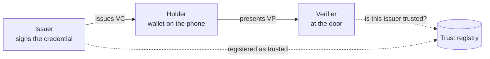
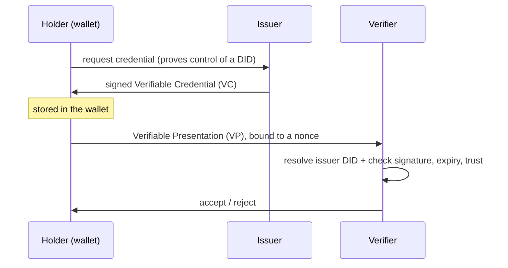
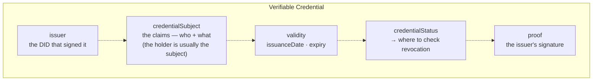
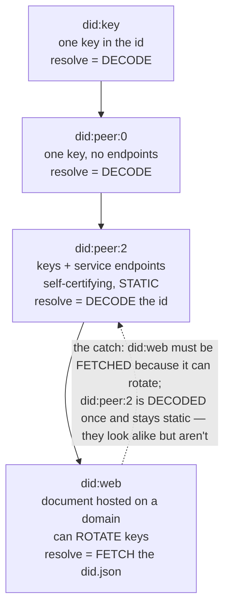
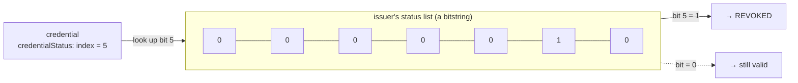
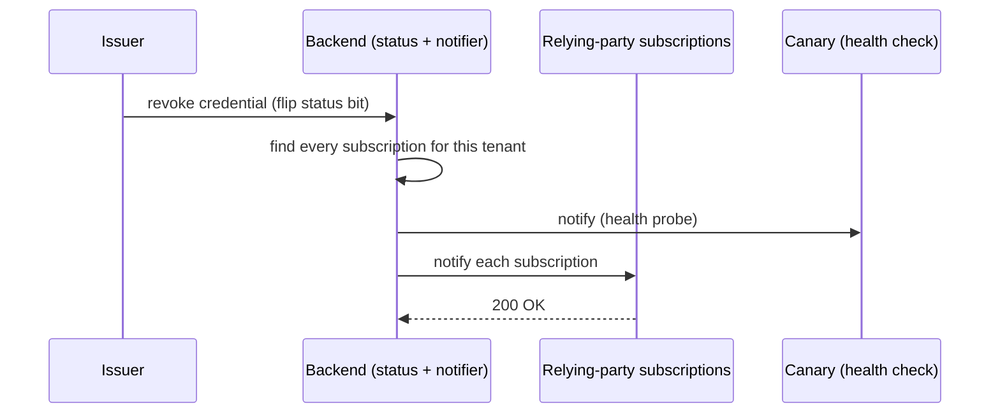
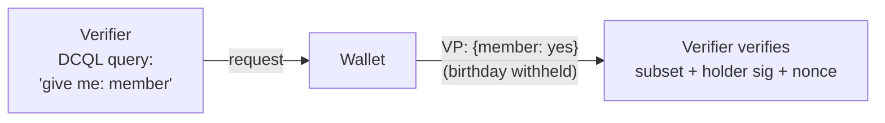

# Kata: Credentials

A **decentralized-identity** membership system. Clubs and leagues issue **verifiable credentials**
to their members, a member keeps the credential in a **wallet** on their phone, and the door
scanner **verifies** it. Two packages: a **Rust** issuer and verifier service (with a status-change
webhook notifier), and a **Flutter/Dart** holder wallet.

This is a **driving-test kata**: you work the problem *with* an AI assistant, and you are training
the disciplines that keep AI output correct, not raw typing speed. Most of the traps here are
invisible to a naive "fix the bug / implement this" prompt. Like every Cedar kata it adds a second
axis on top of the basics: the system spans two packages plus a **read-only external reference**
(a method spec, a sibling service's contract, and the infrastructure configuration the services
run against), so part of the job is establishing context that no single file states.

| | |
|---|---|
| **Estimated time** | ~165 min — XL tier, two staged bug tickets plus a feature; provisional (spec method, no recorded run yet) |
| **Estimated tokens** | ~77k by the spec's method — provisional; the other XL Cedar kata measured coached runs at several times its estimate, so budget generously |
| **Stack / domain** | Rust backend (issuer, verifier, status notifier) + Flutter/Dart wallet · decentralized identity / verifiable credentials |
| **Context version** | [`cedar`](../../context/cedar/) @1.2.0 |

## Background

Verifiable credentials are a niche domain, so start here: plain language and diagrams that teach
the domain before you touch any code.

**The three roles.** An **issuer** signs a claim about you. You, the **holder**, keep it in a
wallet. A **verifier** checks it when you present it. A **trust registry** lets a verifier decide
whether an issuer is one it trusts.



**What a VC is, and its lifecycle.** A **Verifiable Credential** is a signed set of claims (e.g.
"member in good standing, expires 2027-01"). The holder presents it as a **Verifiable Presentation
(VP)**: the VC wrapped and signed by the holder, bound to a one-time **nonce** so it can't be
replayed.



**Anatomy of a VC.** A credential is not free text. It is a structured object with named parts.
The part newcomers miss is the **status reference**: a pointer that says *where to check, later,
whether this credential is still valid*, because a credential can be **revoked after it was
issued** (see below). Reading a VC means knowing which part carries what:



**DID methods.** A **DID** ("decentralized identifier") names a subject; **resolving** it means
fetching the **DID Document** (its public keys and service endpoints). Methods differ in *how* you
resolve, and the difference matters here:

- **`did:key`**: one public key packed into the identifier itself. Resolve = **decode the
  string**. Simplest; no service endpoints, no key rotation.
- **`did:peer:0`**: a single inception key, self-contained; still no endpoints. Resolve = **decode
  the string**. (did:key's peer cousin.)
- **`did:peer:2`**: multiple keys **and service endpoints** encoded into the identifier, giving a
  *full* DID Document. Resolve = **decode the string**. It is **self-certifying and static**:
  everything you need is *in the id*, so a document you built once stays valid.
- **`did:web`**: the DID Document is **hosted on a web domain**
  (`did:web:issuer.example` → `https://issuer.example/.well-known/did.json`). Resolve = **HTTP GET
  that document**. It supports **key rotation and endpoints**, but it is **not** self-certifying:
  the truth is whatever the domain serves *now*, and resolution **crosses a network/infra
  boundary**.



**Revocation & status lists.** Signing a credential is not the end of its life. Membership lapses,
a badge is withdrawn, so an issuer needs a way to say *"this one is no longer valid"* **without
re-issuing anything**. The standard shape is a **status list**: the issuer publishes one long
**bitstring**, every credential it issues carries an **index** into that list (the
`credentialStatus` part above), and to revoke credential *N* the issuer flips **bit *N*** from 0 to
1. A verifier checks validity by reading the bit at that index.



**Status changes are pushed to relying parties by webhook.** A verifier could re-read the whole
status list on every check, but relying parties usually want to *hear about* a change as it
happens. So when a status flips, the backend **fans out a webhook** to every relying-party
subscription, and a built-in **canary** subscription lets the team confirm the notifier is alive:



**Presentation & selective disclosure (DCQL).** When a holder presents a credential, the verifier
doesn't always need *every* claim: a door scanner may need only "member: yes", not your birthday.
The verifier expresses *what it wants* as a **DCQL** query (Digital Credentials Query Language);
the wallet answers with a VP that discloses **only that subset**, still signed by the holder and
bound to the verifier's nonce and domain.



## Setup

```bash
cd practices/credentials/backend && cargo fetch --locked      # Rust 1.98.1, pinned by rust-toolchain.toml
cd ../app && flutter pub get --enforce-lockfile                # Flutter 3.47.5
cd ../backend && cargo test --offline --locked                 # backend unit suite, green
cd ../app && flutter test --no-pub                             # wallet unit suite, green
```

This file, `practice.json` and `_solutions/` are **exercise material**, and the harness keeps all
three out of the clone your assistant works in. What it gets is the two packages, the read-only
`reference/`, and the work item of the moment: a task, not a briefing.

**The work items arrive one at a time**, the way work does:

1. The clone starts with **`TICKET-1.md`** only (and `reference/`, which is there from day one).
2. **`TICKET-2.md`** is handed to you once Ticket 1's fix **lands**.
3. **`FEATURE-REQUEST.md`** arrives when phase 3 begins, after the last ticket.

You never hold two bug reports, or a bug report and the feature request, at once.

A hidden grader is the objective gate for **both tickets and the feature**, across both packages,
and **the harness runs it, not you and not your assistant.** The green unit suites above are not
the bar.

## The five phases (work them in order, on a clock)

1. **Understand** *(no edits)* — *read-before-delegate, establish-cross-boundary-context,
   reconcile-docs.* Map both packages: the backend's issue → verify path and its notifier, and the
   wallet's store and presentation stub. This kata also has a **research pass**: read everything in
   `reference/` (the method spec, the trust registry's contract, how issuer documents are hosted,
   the notifier's deployment configuration, the platform's domain-name standard) and write what you
   learn to `research-notes.md`. Then reconcile: does what the code actually does match what the
   backend and app READMEs and comments claim? Don't let the assistant change anything yet.
2. **Fix the bugs** — *reproduce-before-fix, model-before-delegation, comprehension-as-ownership,
   verify-output.* Two tickets, staged, easier first:
   - **Ticket 1.** Read [`TICKET-1.md`](TICKET-1.md). It is a customer symptom, not a file and a
     line. **Build a model of how the door decides an issuer's key is valid before you delegate a
     fix.** A fix aimed at the symptom — the club that complained — can pass the local tests and
     still stay red on the grader; that plateau is measurable only when the fix prompt comes before
     the research pass, or in a fresh executor that has not read `reference/`. A run that fixes with
     the research already in context tends to converge on the first try. **Reproduce it with a
     failing test first**, then fix the *root*. The grader checks the fix
     against every approved issuer, not only the ones in the ticket.
   - **Ticket 2** (handed over when Ticket 1 lands). Read `TICKET-2.md`, again a symptom. Read the
     "what support has confirmed" paragraph as the specification: the ticket is closed when that
     promise holds for every customer, not when the customer who complained is happy. Reproduce
     under the conditions the ticket describes before you change anything, and don't take a green
     health check as evidence of anything until you know what it checks.
3. **Build the feature** — *requirements-elicitation, read-before-delegate,
   restraint-altitude-match.* Read `FEATURE-REQUEST.md` when it arrives. It is deliberately
   underspecified, and it reads like a small job. Gather the requirements *before* you delegate:
   there is a trap that punishes a straight "implement this" prompt, and a request that sounds
   settled is not the same as one that is. The people who own the answers can be asked; your
   assistant is not one of them. Read how the verifier checks a presentation before you build the
   holder side. Build the **smallest correct thing**.
4. **Improvements** — *verify-output, restraint-altitude-match.* Ask the assistant to find (not
   recite) the highest-value correctness and robustness issues remaining, ranked, across both
   packages. There are several real ones seeded in the code. Fix the ones in scope; name the rest
   and defer them out loud.
5. **Review** — *reject-on-camera, comprehension-as-ownership (FM-14: review with triage and
   intent).* Review the whole diff as if it were a teammate's PR: name a weakness in your own
   change, say what you verified and what the AI got wrong, and state one trade-off you made and
   the condition under which you'd revisit it. A human owns the merge; keep the diff small.

> **Grading.** The hidden grader is the objective gate, and **the harness runs it, not you and not
> your assistant.** Neither of you ever sees it. Be clear about what that gate is worth: its 50
> points cover **phases 2 and 3 only** (both tickets and the feature). Phases 1
> (understand/research), 4 (improve) and 5 (review) are not in that number at all. They are judged
> from your transcript against the rubric's driving axis, so a green 50/50 is silent on more than
> half of what the kata trains. Clearing the gate is the floor. How you *drove* is the other half,
> and the half this platform cares about most: reproduced before fixing, established the
> cross-package and external context before delegating, rejected bad output, and matched the
> altitude of the exercise instead of over-building. See the [rubric](_solutions/rubric.md) after
> you finish (don't read it first).

`_solutions/` holds the answer key (hidden graders, held-back requirements, trap manifest, rubric,
reference fixes). **Opening it defeats the kata**: the whole point is to reach the answers by
driving the assistant well.

## Proof that it works (maintainers)

A recorded end-to-end run of this kata lives in `_solutions/proof-train-2026-09-29.html`: a
`train`-mode session through the harness on 2026-09-29, with the assistant a fresh
`claude -p --model opus` (resolved `claude-opus-5-5`, CLI 2.1.284) working in a stripped, jailed
clone outside the repo, resumed turn after turn, and `TICKET-2.md` and `FEATURE-REQUEST.md` staged in
one at a time, each only after the previous item's grader axis went green. It is a **calibration
run**, not a learner grade: the learner's prompts, the stakeholders' answers and the trainer's notes
were written by an operator who could read the answer key (AGENTS.md rule 10), so it shows how the
assistant behaves and whether the traps fire, not how an independent learner drives; its separate
examiner found that operator-written content pre-empted most traps in this run. It documents the
harness, date and model used; the control run (one casual, uncoached prompt with both tickets and
the feature request in hand, which did not clear the gate) and what it scored; the naive and
elicited feature builds; and for each phase: the learner's prompt, how the assistant behaved, the
trap that fired *by design*, the trainer's notes with the examiner's ruling on each, and the real
command outcome at baseline and at the end. It lives in `_solutions/` because it necessarily
reveals the fix, so **don't open it before attempting the kata.**

Maintainers verifying the kata use the declared commands in `practice.json` against a copy that
still has `_solutions/`: `commands.grade` for the gate (the shipped tree fails all three axes, the
reference fixes pass them), and, beside it, the examiner-only robustness probes described in
`_solutions/rubric.md`. The trap manifest records every planted item and the measured evidence that
each trap bites.
