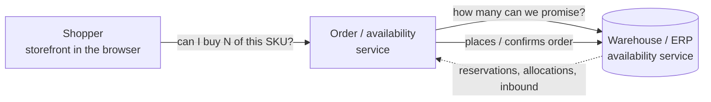
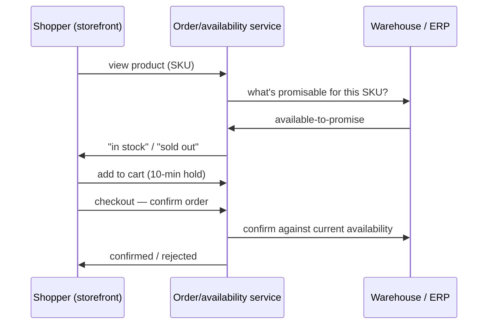
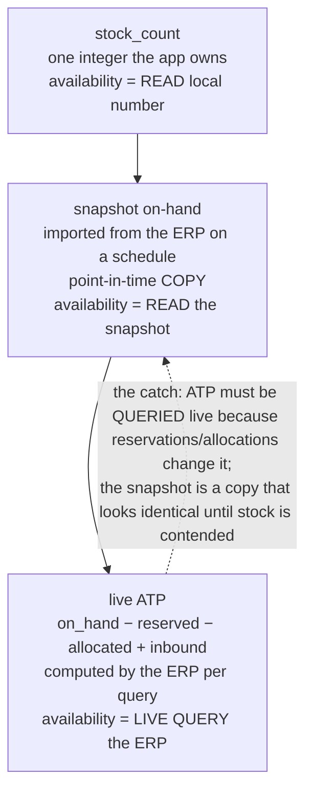

# DESIGN — `fulfillment` (Cedar practice blueprint)

> **Status: DESIGN ONLY — not a runnable practice yet.** This folder deliberately contains no
> `practice.json`, `backend/`, `web/`, or `_solutions/`, so the harness will not list or run it. This
> file is the blueprint a follow-up build session consumes to produce the runnable, graded,
> proof-recorded kata per [`generator/CONTRACT.md`](../../generator/CONTRACT.md) and
> [`context/cedar/generation-spec.md`](../../context/cedar/generation-spec.md). Draft `practice.json`
> and `_solutions/` plans are embedded below.

## Overview
- **id:** `fulfillment` · **title:** "Fulfillment — inventory availability & order confirmation"
- **Context:** `cedar@1.0.0` · **difficulty:** `XL`
- **Domain:** commerce fulfillment — a storefront checks whether an item can be shipped and confirms
  orders against a warehouse/ERP's **available-to-promise (ATP)**.
- **Stack (multi-package, both graded — React + TS Node full stack):**
  - `backend/` — **TypeScript / Node** order + availability service (checks availability, holds a
    reservation, confirms an order, resolves a SKU's ATP).
  - `web/` — **React (Vite + TypeScript)** storefront (browse, "in stock" badge, add-to-cart hold,
    checkout).
  - `reference/` — **read-only external truth**: the sibling **ERP availability-service contract**, the
    cloud-hosted **availability feed** (`reference/infra/erp-availability/*.json`), and the **ATP
    calculation spec**.
- **Trains:** the full Alder core set **plus** Cedar's *establish-cross-boundary-context* and
  *reconcile-docs*. Failure modes: FM-01, FM-02, FM-03, FM-04, FM-05, FM-06, FM-07, FM-08, FM-13,
  **FM-15**, **FM-16** (+ FM-14 on the review phase).
- **The Cedar thesis in one line:** the exercise is *complex in the fog, small in the fix* — the
  multi-package/hosted-ERP setup and two layers of drifting docs make the bug hard to *understand*;
  the correct change itself is a handful of lines.
- **The one-line hook (the user's ask):** it presents as the classic **"works on my machine / green on
  staging, oversells in production"** bug — the same code path is correct against local seed data and
  wrong against the live ERP.

## Intended repository layout
```
fulfillment/
  backend/            # TS/Node: src/ (availability resolver, reservation store, order confirm, catalog) + tests
  web/                # React: src/ (product page, stock badge, cart hold, checkout) + tests
  reference/          # READ-ONLY: erp-availability-contract.md, infra/erp-availability/*.json, atp-spec.md
  _solutions/         # hidden answer key (see plan below)
  TICKET.md  FEATURE-REQUEST.md  README.md  practice.json  grade.sh
```

---

## Domain primer (graphical — to be lifted verbatim into `README.md` → Background)

Fulfillment/ATP is a niche domain, so the learner-facing README **opens with this**: plain language +
diagrams that teach the domain **before any code** and **without pointing at the bug** (scaffolding,
not a hint). Three diagrams, mirroring how `credentials` taught DID methods.

**The pieces.** A **shopper** browses a **storefront**. The storefront asks the **order/availability
service** whether an item can be shipped. That service answers from the **warehouse/ERP**, which is the
source of truth for how much stock is really promisable.



**The order/availability lifecycle.** Browse → check availability → (optionally) hold a reservation
while checking out → confirm. Each step asks "is there enough to promise?"



**How "availability" is determined — the crux of this kata.** How a system answers "how many can we
promise?" is exactly the difference the exercise turns on. Three ways a fulfillment system can compute
it, in the order most real systems adopt them:

- **`stock_count`** — a single integer the app owns and decrements on each order. Dead simple; no
  concept of reservations or inbound. Availability = **read the local number**.
- **snapshot on-hand** — the app periodically **imports on-hand** from the ERP into a local
  `availability_snapshot`. Still one number per SKU, just refreshed on a schedule. Availability =
  **read the imported snapshot**. It is a **point-in-time copy**: correct at import, drifts afterward.
- **live ATP (available-to-promise)** — the ERP computes, per query,
  `on_hand − reserved − allocated + inbound-within-lead-time` and answers **now**. Availability =
  **live query to the ERP**. It reflects reservations and allocations the app never sees locally, so it
  is the only figure that's right when stock is contended.



**How environments are wired (normal onboarding, not a hint).** Every service that talks to an ERP
stubs it for local work: **dev/CI** is seeded from vendored fixtures so tests are hermetic and fast;
**production** talks to the real ERP. The availability source is chosen behind one resolver seam so the
rest of the code doesn't care which environment it's in. (This is ordinary architecture — it is *why*
"it worked on my machine" is worth taking seriously in this domain.)

---

## The repo's true history (the setup for every trap)
The service grew the way AI-assisted repos really do — simplest-first, migrated *mostly*, not
everywhere:
1. **Started on `stock_count`** (one integer, decremented per order).
2. **Moved to a nightly ERP `availability_snapshot`** when a single owned counter couldn't keep up with
   warehouse reality.
3. **Migrated to live `ATP`** (current, authoritative) so contended stock (reservations, allocations,
   backorder-inbound) would stop overselling.

The current system is **live ATP**. But the migration left two kinds of rot behind.

## Primary bug — context rot buried in code (FM-15 + FM-01/02, cause across the boundary FM-16)
**The abandoned assumption:** *"availability is the on-hand number we already hold locally — read it,
don't ask the ERP."* That was **true** in the `stock_count`/snapshot era. It is **silently false** for
live ATP, which reflects reservations the local copy never has.

**Where it hides:** a long-untouched availability/confirm path (used when placing an order) still reads
`availability_snapshot.on_hand` instead of issuing the **live ATP query**. No README or comment
mentions this; it reads like ordinary resolver code. It survives because the **large green suite** uses
SKU fixtures with **zero reservations**, so snapshot == ATP and everything passes.

**How it fails (the edge ATP exists for):** a SKU with **open reservations / allocations** (or a
backorder with inbound). Its real ATP is below the snapshot on-hand, so the stale path **oversells** —
confirms orders the warehouse can't ship. The true reserved/allocated numbers live only in the
**hosted ERP feed** in `reference/`; the local repo never has them.

**The environment axis — the "works on my local, fails in production" trap (FM-02 × FM-16).** The bug
is engineered to present as *green locally, broken in prod*, and this is load-bearing, not flavor:
- One **resolver seam** selects the availability source by environment. **Dev/CI** is seeded from the
  vendored snapshot fixtures — SKUs with **zero reservations** — so the stale path *happens to be
  correct locally* (snapshot == feed) and **both the app and the whole unit suite pass**.
- **Production** is the live ERP (`reference/infra/erp-availability/*.json`) with **real reservations /
  allocations**, where the snapshot is stale and the identical code **oversells**.
- The learner reproduces prod by pointing the resolver at the `reference/` feed — which is the whole
  point of the **research pass** — and the **grader runs the confirm root against that production
  feed**, so a fix that only satisfies the local seed still fails. This is Cedar's FM-02 (silent,
  "works on my machine") crossed with FM-16 (single-scope/local-vs-global). It is **not** a new failure
  mode — the taxonomy is fixed at FM-01..FM-16.

**Why pure prompting won't find it:** nothing in the repo points at ATP, reservations, or a snapshot;
the docs actively mislead (below); the suite is green; and it reproduces only against data the local
repo doesn't hold. The learner must **reproduce** under a reserved SKU and **read `reference/`** to
discover the system is live-ATP and that availability must be a live query.

**Ambient axis (Cedar's extended FM-02): the SKU's cross-boundary/production availability state**, which
the local repo never parameterized. Graded worst-case across ≥3 SKUs: (a) never-reserved (matches the
local seed), (b) open reservations, (c) backordered + inbound.

**TICKET.md symptom (no file/line):** *"Works fine on staging and on every dev's machine, but in
production a handful of SKUs we started pre-selling last month let customers order more than we can
ship — same storefront, same steps."*

## FM-13 plateau (mandatory autopilot trap — verified to bite)
- **Symptom-patch** (fix at the call site — e.g. special-case the oversold SKU in the checkout
  handler): leaves the **root-tested** grader red (the grader calls the availability/confirm path
  directly).
- **The "obvious" autopilot fix**: re-import / refresh **the one failing SKU's** snapshot, or hard-code
  its ATP from the ticket. Passes that SKU and the whole visible suite — then **plateaus**: the next
  reserved SKU (or the same SKU's next reservation change) oversells again.
- **Only convergence:** implement a **real live ATP query** — ask the ERP per the `reference/` spec —
  so *any* SKU resolves correctly. (Caching/TTL is a named aside, **not** built — restraint /
  altitude-match.) This is the per-instant/DST analogue of the seed kata.

## FM-16 cross-boundary trap — the truth lives only in `reference/`
`reference/` holds what the single repo cannot see:
- `reference/erp-availability-contract.md` — the sibling service contract: availability is a **live
  query** keyed on **(SKU, location)**; it returns ATP, not on-hand.
- `reference/infra/erp-availability/*.json` — the **cloud-hosted availability feed** per SKU, including
  the **reservations / allocations / inbound** the local snapshot doesn't have.
- `reference/atp-spec.md` — the calculation spec: `ATP = on_hand − reserved − allocated +
  inbound-within-lead-time`, and that on-hand alone is not promisable.

A single-repo autopilot "reads the code," sees a resolver that already returns numbers, and assumes
it's correct — **locally green, globally wrong**. The escape is the **research pass**: read
`reference/`, write **`research-notes.md`** ("we're on live ATP; availability is a live query;
reservations live in the ERP; the snapshot is stale in prod"), *then* delegate. The grader embeds
**conformance vectors derived from the hosted feed**, so a fix that never read `reference/` fails them.

## FM-15 doc-drift traps — maximum misdirection (see `_solutions/doc-drift-ledger.md`)
- **Headline:** `backend/README.md` still says *"stock is decremented from `stock_count` on each
  order"* — **two migrations stale**. A naive prompter chases the local counter and never reaches ATP.
- A `backend/src/…` comment references *"the nightly snapshot"* (the snapshot era) near the stale
  resolver.
- A field-name drift: docs say `available`; the code uses `on_hand`; the ERP uses `atp`.
- `web/README.md` says the storefront calls `GET /stock`; the current API is `GET /availability`.
- A README line claims *"we never oversell — a DB constraint prevents it"* that the code does **not**
  enforce (this becomes the feature's held-back requirement).
- The ledger names, for each, the **authoritative source** (current `backend/` code + `reference/`) and
  states plainly: *README says `stock_count`, the code mostly does live ATP, and one stale path still
  reads the snapshot as if it were promisable.*

## Underspecified feature (phase 3 — FM-03 / read-before-delegate)
**FEATURE-REQUEST.md (2–3 sentences):** *"Let a shopper reserve an item for 10 minutes while they check
out (a cart hold). Add the hold to the storefront and the backend."* ⚠️ hint: *read how the confirm
path decides availability before you build the hold.*

The naive impl double-counts holds, holds against the stale snapshot, or leaks holds forever.
**Held-back questions (`_solutions/feature-qa.md`, 6–8):**
1. Does a hold **decrement ATP** for other shoppers, or is it advisory only?
2. Is the hold keyed on **cart** or on **(SKU, cart)** — can one cart hold the same SKU twice?
3. **TTL / expiry:** how and when are expired holds released (ties FM-07)?
4. What happens at **exactly-zero ATP** — can you hold the last unit; what about the shopper already
   holding it?
5. Does the hold **survive an availability change** (the SKU's ATP dropping under the held quantity)?
6. Is the hold **checked live at confirm**, or trusted from when it was placed?
7. Online or offline (does placing a hold require an ERP round-trip)?
8. What is the minimal correct surface — and what is explicitly deferred?

**Minimal correct behaviour:** a hold that reserves against **live ATP**, keyed on the business entity,
released on TTL, re-checked at confirm; everything else deferred out loud.

## Ranked latent defects (findable, mapped to FMs — for `_solutions/trap-manifest.md`)
1. **FM-06** — order idempotency dedupes on a transport **`requestId`**, not the business key
   (`orderId`/`cartId`); a retry with a fresh requestId **double-decrements**.
2. **FM-05** — the availability/reservation store returns its **internal object by reference**, letting
   a caller mutate held state (e.g. the cached availability record or the hold list).
3. **FM-07** — the reservation/hold map grows **unbounded** (no TTL eviction of expired holds).
4. **FM-04** — ATP compared with strict `>` / `>=` at exactly **0**; the boundary (can you take the
   last unit?) is unspecified and untested → off-by-one oversell.
5. **FM-03** — an **"inbound counts if within 30 days"** approximation (month ≈ 30 days), or an
   **unknown-SKU fall-through to "available."**
6. **FM-08** — a free-form **warehouse/location code** trusted without validating against the ERP's
   authoritative location set in `reference/`, so a typo resolves to a wrong (or empty) location
   silently.
7. *(optional 7th, keeps commerce realism)* **FM-03** — a currency/price rounding or a "reserved counts
   only if created today" cadence bug adjacent to the hold logic.

## Dual grade design (both stacks; combined worst-case)
`commands.grade` = **`bash grade.sh`**, which runs and ANDs:
- **(a) backend acceptance** (`node --test`, or `vitest run`, in `backend/`) — the hidden suite calls
  the availability/confirm **root** directly with the resolver pointed at the **production**
  `reference/` feed (not the local seed), across ≥3 SKU states (never-reserved / reserved /
  backordered-inbound) **plus** the `reference/`-derived conformance vectors. Reports worst-case. This
  is the step that turns a "green on my machine" run red.
- **(b) web integration** (React Testing Library, or Playwright component test, in `web/`) — the
  storefront produces an add-to-cart/checkout request the backend **accepts** for a promisable SKU and
  correctly **rejects** (no oversell) for a contended one.

Exit 0 only if **both** pass at worst-case. **Hermetic:** pinned Node + a pinned web toolchain, **no
network** (the "hosted" ERP feed is served from vendored `reference/infra/` fixtures via a local
file/loopback resolver), conformance vectors vendored. **Fallback recorded in notes:** if the web gate
is too heavy for CI, grade `backend/` only at `grade` level and demote the cross-stack check to `test`
level.

## The five-phase flow (research pass lives inside *understand*)
1. **understand** — map both packages *and* **do the research pass**: read `reference/`, write
   `research-notes.md` (the FM-16 escape). Establish: current method = live ATP; availability = live
   query; reservations live in the ERP; the snapshot is stale in prod; the README is two migrations
   behind.
2. **fix** — reproduce with a reserved-SKU failing test against the `reference/` feed (FM-01/02), then
   implement the real live ATP query at the root (escape the FM-13 plateau).
3. **feature** — elicit the held-back requirements, build the minimal correct cart hold.
4. **improve** — find the ranked latent defects; fix the ones in scope, surface the rest (restraint).
5. **review** — triage + intent (FM-14): a human owns the merge; the diff stays small.

---

## Draft `practice.json` (the build session finalizes this)
```json
{
  "id": "fulfillment",
  "title": "Fulfillment — inventory availability & order confirmation",
  "contextVersion": "cedar@1.0.0",
  "domain": "commerce fulfillment / inventory available-to-promise",
  "stack": {
    "packages": [
      { "path": "backend", "language": "typescript", "runtime": "node>=20", "dependencies": 0 },
      { "path": "web", "language": "typescript", "runtime": "node>=20 (vite+react)", "dependencies": 0 }
    ]
  },
  "difficulty": "XL",
  "estimate": { "minutes": 135, "tokens": 60000 },
  "phases": ["understand", "fix", "feature", "improve", "review"],
  "reference": "reference/",
  "researchArtifact": "research-notes.md",
  "commands": {
    "install": "cd backend && npm ci; cd ../web && npm ci",
    "test": "cd backend && npm test; cd ../web && npm test",
    "grade": "bash grade.sh"
  },
  "grader": { "kind": "hidden-acceptance", "max": 12 },
  "trainingPoints": {
    "disciplines": ["reproduce-before-fix", "requirements-elicitation", "read-before-delegate", "model-before-delegation", "comprehension-as-ownership", "verify-output", "restraint-altitude-match", "reject-on-camera", "establish-cross-boundary-context", "reconcile-docs"],
    "failureModes": ["FM-01", "FM-02", "FM-03", "FM-04", "FM-05", "FM-06", "FM-07", "FM-08", "FM-13", "FM-14", "FM-15", "FM-16"]
  },
  "primaryBug": "a stale availability path reads the local availability_snapshot on-hand instead of querying live ATP, so SKUs with reservations/allocations oversell in production while staying green on local seed data (the abandoned stock_count/snapshot 'availability is the number we hold locally' assumption, no doc trace)",
  "featureTrap": "the 10-minute cart hold must reserve against live ATP, be keyed on the business entity, expire on TTL, and be re-checked at confirm; the naive hold double-counts, holds against the stale snapshot, or leaks",
  "assistantTrap": "autopilot loops: symptom-patching the checkout handler leaves the root-tested grader red; re-importing the one failing SKU's snapshot passes the suite but plateaus on the next reserved SKU; only a real live ATP query converges",
  "docDriftTrap": "backend README still says stock is decremented from stock_count (two migrations stale) and a comment references the nightly snapshot; the current system is live ATP and one path still reads the snapshot as promisable",
  "crossBoundaryTrap": "the current reservations/allocations/inbound live only in reference/infra/erp-availability/*.json and the ATP spec; a single-repo run assumes the local snapshot is authoritative and passes locally but fails the reference-derived conformance vectors (works-on-my-machine, fails in prod)",
  "latentDefects": 6,
  "answerKey": "_solutions/",
  "notes": "XL tier; provisional estimate. Dual grade gate (Node backend + React web) is hermetic via vendored reference/infra fixtures and a loopback resolver; backend-only is the documented fallback if the web gate is too heavy for CI."
}
```

## `_solutions/` plan (build session produces these)
- `backend/…/acceptance.test.ts` + `web/…/integration.test.tsx` — hidden graders; start failing.
- `grade.sh` — the wrapper; resolver pointed at the `reference/` feed; ≥3 SKU states + conformance
  vectors; combined worst-case.
- `FIX.md` — the real live ATP query at the resolver root; why the re-import fix plateaus; the caching
  aside.
- `feature-qa.md` — the 6–8 held-back questions above, with answers + minimal correct behaviour.
- `trap-manifest.md` — every planted item → FM id + location; **verified-to-bite** notes for the FM-13
  plateau, the FM-15 stale path + stale README, and the FM-16 no-research run.
- `rubric.md` — objective gate (both stacks, worst-case) + driving axis, adding items for the research
  pass (FM-16) and doc reconciliation (FM-15).
- `context-map.md` — the golden cross-boundary contract (current method = live ATP, hosted-feed truth,
  the one load-bearing fact: on-hand ≠ promisable).
- `doc-drift-ledger.md` — every contradiction + its authoritative source.
- `proof-<mode>-<YYYY-MM-DD>.html` — recorded end-to-end run (generator CONTRACT step 10).

## Build TODO (out of scope now; the follow-up session)
1. Write `backend/` (availability resolver with the stale snapshot branch, reservation store, order
   confirm, catalog), `web/` (product page + stock badge + cart hold + checkout), and `reference/`
   fixtures + the loopback resolver.
2. Write the GREEN unit suites (bug invisible: local seed SKUs never have reservations).
3. Wire the hidden graders + `grade.sh`; **verify the traps bite** (symptom-patch red; re-import
   plateaus; no-research run fails the conformance vectors; local-green vs prod-red demonstrated).
4. Fill the real `practice.json` (drop `status`), lift the primer into `README.md`, write `TICKET.md` /
   `FEATURE-REQUEST.md`.
5. Drive it once end-to-end (a `train` run) and record `_solutions/proof-train-<date>.html`.
6. Fresh-context reviewer confirms it's solvable at XL altitude — not over-scoped.
