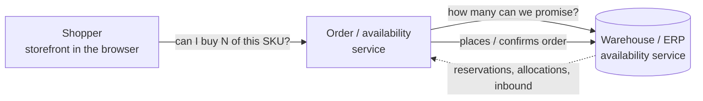
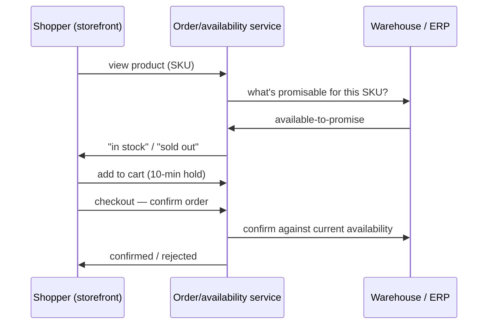
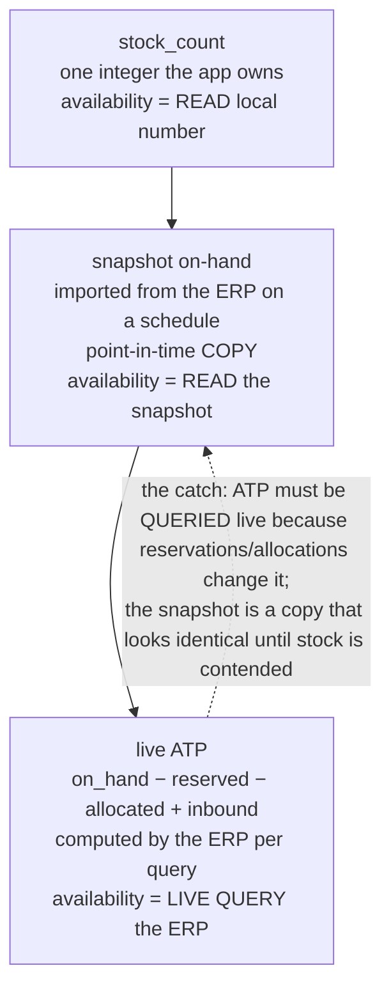

# Kata: Fulfillment

A **commerce fulfillment** service — a storefront checks whether an item can be shipped and
confirms orders against a warehouse/ERP's **available-to-promise (ATP)**. Full stack: a
TypeScript/Node order + availability service, and a React (Vite + TypeScript) storefront.

This is a **driving-test kata**: you work the problem *with* an AI assistant, and you are
training the disciplines that keep AI output correct — not raw typing speed. Most of the traps
here are invisible to a naive "fix the bug / implement this" prompt, and this kata adds a second
axis on top of the basics: the system spans two packages plus a **read-only external reference**
(a sibling ERP contract), so part of the job is establishing context that no single file states.

| | |
|---|---|
| **Estimated time** | ~135 min (XL tier) |
| **Estimated tokens** | ~60,000 (one assistant, five phases) |
| **Stack / domain** | TypeScript/Node backend + React (Vite + TS) storefront · commerce fulfillment / inventory ATP |
| **Context version** | [`cedar`](../../context/cedar/) @1.1.0 |

## Background

Fulfillment/ATP is a niche domain, so start here — plain language and diagrams that teach the
domain before you touch any code.

**The pieces.** A **shopper** browses a **storefront**. The storefront asks the **order/availability
service** whether an item can be shipped. That service answers from the **warehouse/ERP**, which is
the source of truth for how much stock is really promisable.



**The order/availability lifecycle.** Browse → check availability → (optionally) hold a
reservation while checking out → confirm. Each step asks "is there enough to promise?"



**How "availability" is determined.** Three ways a fulfillment system can compute it, in the
order most real systems adopt them:

- **`stock_count`** — a single integer the app owns and decrements on each order. Dead simple; no
  concept of reservations or inbound. Availability = **read the local number**.
- **snapshot on-hand** — the app periodically **imports on-hand** from the ERP into a local
  `availability_snapshot`. Still one number per SKU, just refreshed on a schedule. Availability =
  **read the imported snapshot**. It is a **point-in-time copy**: correct at import, drifts
  afterward.
- **live ATP (available-to-promise)** — the ERP computes, per query,
  `on_hand − reserved − allocated + inbound-within-lead-time` and answers **now**. Availability =
  **live query to the ERP**. It reflects reservations and allocations the app never sees locally,
  so it is the only figure that's right when stock is contended.



**How environments are wired (normal onboarding, not a hint).** Every service that talks to an
ERP stubs it for local work: **dev/CI** is seeded from vendored fixtures so tests are hermetic and
fast; **production** talks to the real ERP. The availability source is chosen behind one resolver
seam so the rest of the code doesn't care which environment it's in. (This is ordinary
architecture — it is *why* "it worked on my machine" is worth taking seriously in this domain.)
We never oversell — a database constraint prevents it, so the interesting work here is about
*deciding* availability correctly, not about a backstop catching the mistake.

## Setup

```bash
cd practices/fulfillment/web && npm ci   # installs the storefront's deps; backend is zero-dependency
cd ../backend && npm test                # backend unit suite, green
cd ../web && npm test                    # web unit suite, green
```

This file, `practice.json` and `_solutions/` are **exercise material**, and the harness keeps all
three out of the clone your assistant works in. What it gets is the two packages, the read-only
`reference/`, and the work items — a task, not a briefing.

A hidden grader is the objective gate for the **whole ticket** — availability correctness (the
bug), the cart hold (the feature), and the storefront together — and **the harness runs it, not
you and not your assistant.** The green unit suites above are not the bar.

## The five phases (work them in order, on a clock)

1. **Understand** *(no edits).* Map both packages — the backend's availability/confirm path and
   the storefront's product, cart, and checkout flow. This kata also has a **research pass**:
   read everything in `reference/` (the sibling ERP's contract, its hosted availability feed, and
   the ATP calculation spec) and write what you learn to `research-notes.md`. Then reconcile —
   does what the code actually does match what the backend and web READMEs and comments claim?
   Don't let the assistant change anything yet.
2. **Fix the bug.** Read [`TICKET.md`](TICKET.md). It is a customer symptom, not a file and line.
   **Build a model of how availability is actually decided before you delegate a fix** —
   prompting "just fix it" without reproducing first will loop: it passes the local unit tests and
   stays red on the grader, or it patches one symptom and the defect resurfaces on the next SKU.
   **Reproduce it with a failing test first**, then fix the *root*. The grader checks the fix
   against the real ERP feed across several SKU states — a fix that only satisfies your local
   seed data does not pass.
3. **Build the feature.** Read [`FEATURE-REQUEST.md`](FEATURE-REQUEST.md). It is deliberately
   underspecified. Gather the requirements *before* you delegate — there is a trap that punishes a
   straight "implement this" prompt. Build the **smallest correct thing**.
4. **Improvements.** Ask the assistant to find (not recite) the highest-value correctness and
   robustness issues remaining, ranked, across both packages. There are several real ones seeded
   in the code.
5. **Review.** Review the diff as if it were a teammate's PR: name a weakness in your own change,
   say what you verified and what the AI got wrong, and state one trade-off you made and the
   condition under which you'd revisit it.

> **Grading.** The hidden grader is the objective gate (correctness against the real availability
> feed, backend and web together), and **the harness runs it — not you, and not your assistant.**
> Neither of you ever sees it. But be clear about what that gate is worth: a recorded control run —
> a fresh assistant, one casual prompt, no follow-up — took the availability half of it **14/14**,
> reading the external spec of its own accord. Clearing the gate is **not** the same as having
> driven well; it is the floor. How you *drove* — reproduced before fixing, established the
> cross-package/external
> context before delegating, rejected bad output, matched the altitude of the exercise instead of
> over-building — is the other half, and the half this platform cares about most. See the
> [rubric](_solutions/rubric.md) after you finish (don't read it first).

`_solutions/` holds the answer key (hidden tests, held-back requirements, trap manifest, rubric).
**Opening it defeats the kata** — the whole point is to reach the answers by driving the assistant
well.

## Proof that it works (maintainers)

A recorded end-to-end run of this kata lives in `_solutions/` as a `proof-<mode>-<date>.html`
file (added once the kata has been driven once end-to-end). It documents the harness, date, and
model used, and for each phase: the learner's prompt, how the assistant behaved, the trap that
fired *by design*, and the real command outcome. It lives in `_solutions/` because it necessarily
reveals the fix — **don't open it before attempting the kata.**
